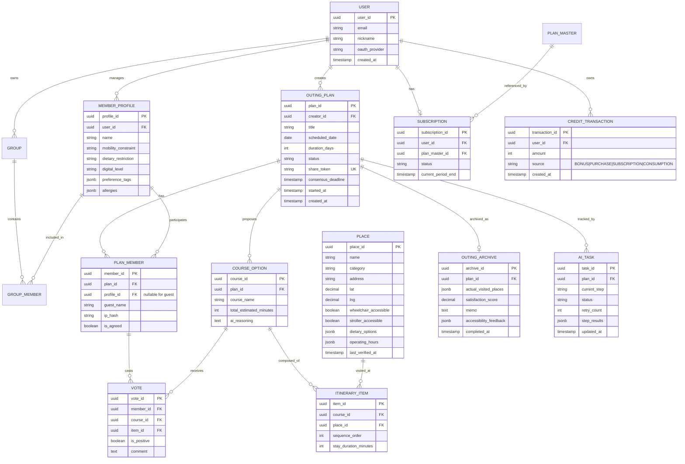

# 모두의 나들이 (Monali) 개발 명세서

> **PRD + 기술 설계서 (Product Requirements & Technical Design Document)**

---

## 📋 문서 정보

|항목|내용|
|---|---|
|문서명|모두의 나들이 (Monali) 개발 명세서|
|버전|v1.0|
|작성일|2026-05-28|
|작성자|홍길동 사장님|
|상태|Draft (팀 검토 대기)|
|분류|PRD + Technical Design|

### 변경 이력 (Change Log)

|버전|일자|작성자|변경 내용|
|---|---|---|---|
|v1.0|2026-05-28|홍길동 사장님|분석 리포트 + 사전 PRD(섹션 12) 통합 초안 작성|

---

## 📑 목차

1. 제품 개요
2. 기능 요구사항 (Functional Requirements)
3. 비기능 요구사항 (Non-Functional Requirements)
4. 정보 구조 및 UI 설계
5. 데이터 설계
6. API 설계
7. 기술 아키텍처
8. 개발 계획
9. 부록

---

## Chapter 1. 제품 개요

### 1.1 비전 (Vision)

> **“제약은 줄이고 추억은 늘리는, 우리 가족 맞춤형 AI 나들이 플래너”**

휠체어·유모차·식이 제한 등 가족 동반자의 제약을 한 번만 등록하면, AI가 외부 데이터(공공데이터·지도 API)로 검증된 근거리 가족 나들이 코스를 자동 설계하고, 비회원 동반자까지 합의 가능한 가족 맞춤형 나들이 플래너 서비스.

### 1.2 배경 (Background)

평범한 워킹맘이 주말 가족 나들이 한 번을 계획하는 데 평균 2~3시간을 5~10개 채널을 순회하며 소요하지만, 정보의 신뢰성·최신성·일관성이 보장되지 않아 헛걸음이 빈번하다. 휠체어·유모차·식이 제한 등의 제약 조건은 매번 반복 입력해야 하고, 가족 합의는 단톡방 침묵으로 끝나며, 디지털 약자(어르신)는 일정 공유에서 소외된다. 다녀온 나들이는 1~2개월 만에 휘발되고, 기존 AI 플래너는 환각으로 신뢰를 잃고 있다. 모두의 나들이는 **제약 조건 자동 반영 + RAG 기반 검증 + 비회원 합의 + 인쇄 친화 출력**의 결합으로 이 공백을 메운다.

### 1.3 범위 (Scope)

**In-Scope (Must + Should)**

- 가족 제약조건 통합 프로필 관리
- 외부 API 연동 RAG 기반 AI 코스 설계 엔진 (5단계 파이프라인)
- 비회원 동반자 합의 시스템 (Silent Consent)
- 출발 및 아카이브 (방문 완료율·만족도 추적)
- 크레딧·구독 결제 시스템
- 인쇄 친화적 PDF 일정표 (A4 1장)
- 디지털 약자용 단순화 뷰 (Simple View)
- 나들이 기록 아카이브

**Out-of-Scope (Won’t)**

- 글로벌 여행지 계획 및 예약 서비스 (근거리 가족 나들이 집중)
- 인앱 직접 결제 및 예약 시스템 (외부 링크 연결로 대체)
- 불특정 다수 소셜 네트워크 (개인정보 민감성)

**Could-Have (MVP 이후 검토)**

- 사용자 참여형 접근성 상세 리뷰 시스템
- 검증된 가족 코스 템플릿 공유 마켓
- 위치 기반 실시간 경로 최적화 안내

### 1.4 용어 정의 (Glossary)

|용어|정의|
|---|---|
|동반자 (Companion)|사용자가 등록한 가족·친구 등 함께 나들이 가는 인물(휠체어·유모차·식이 등 제약 보유)|
|그룹 (Group)|동반자를 묶은 단위 (예: “우리 가족”, “양가 부모님”)|
|Silent Consent|비회원 동반자가 무응답일 경우 자동 동의로 간주하는 합의 정책|
|RAG|Retrieval-Augmented Generation, 외부 데이터 검색으로 LLM 환각을 줄이는 방식|
|5단계 파이프라인|skeleton → places → verify → details → route → assemble의 순차 코스 생성 단계|
|크레딧|AI 코스 생성에 사용되는 사용량 단위 (1일치 코스 = 30크레딧)|
|단순화 뷰 (Simple View)|큰 글씨·고대비·핵심 정보 중심으로 재구성된 디지털 약자용 화면|
|환각 (Hallucination)|LLM이 폐업 식당·잘못된 운영시간 등 비실재 정보를 생성하는 현상|

### 1.5 대상 사용자 (Target Users)

|페르소나|김지원 (38세, IT 기업 마케터, 워킹맘)|
|---|---|
|핵심 인용|“가족 모두가 행복한 나들이를 만들고 싶지만, 그 계획을 짜기 위해 매주 주말 전날 밤을 꼬박 새우는 건 너무 지쳐요.”|
|특성|부모님(휠체어) + 자녀(유모차)를 동시에 챙기는 샌드위치 세대 주 계획자. 효율·정확성 중시, 시행착오 스트레스 높음.|
|핵심 니즈|제약 조건 자동 반영, 검증된 접근성 데이터, 비회원 참여형 의사결정, 디지털 약자 배려 출력|
|사용 맥락|주말 전날 밤 계획, 출퇴근 시간 짬짬이, 가족 단톡방 공유 시점|

|부가 타겟|디지털 약자 동반자 (70~80대 어르신)|
|---|---|
|핵심 니즈|큰 글씨 일정표, 종이 출력물, 1탭으로 끝나는 응답 인터페이스|

|부가 타겟|비회원 동반자 (배우자·형제 등 앱 설치 거부)|
|---|---|
|핵심 니즈|가입 없이 링크 한 번으로 의견 표시, 빠른 합의|

---

## Chapter 2. 기능 요구사항 (Functional Requirements)

> 모든 FR은 분석 리포트 섹션 3·5·6·10·11·12를 기반으로 작성되었으며, MoSCoW 우선순위에 따라 분류되어 있습니다. 사전 PRD(섹션 12)의 F1~F6 기능 정의를 통합 반영했습니다.

### 2.1 Must Have

#### FR-001: 가족 제약조건 통합 프로필 관리 (F1)

|항목|내용|
|---|---|
|MoSCoW|**Must**|
|출처|섹션 3 F1 / 섹션 6 Must / 섹션 10 `/profile` / 섹션 11 `MemberProfile`|
|설명|사용자가 가입 직후 본인과 동반자의 제약조건(휠체어·유모차·식이 제한·이동 속도·알러지·디지털 숙련도 등 8종 이상)을 등록하고, 동반자를 그룹으로 묶어 관리. 이후 모든 코스 추천에 자동 반영.|
|관련 페이지|`/auth`(온보딩), `/profile`(프로필 관리)|
|관련 엔티티|`User`, `MemberProfile`, 그룹·그룹 멤버|
|User Story|**AS A** 가족 나들이 주 계획자 **I WANT TO** 가족 구성원의 제약조건을 한 번만 등록하기를 **SO THAT** 매번 검색창에 같은 조건을 반복 입력하지 않고 자동 반영된 추천을 받을 수 있다.|
|Acceptance Criteria|**GIVEN** 사용자가 온보딩에서 동반자를 추가할 때 **WHEN** 이동 제약·식이 제한·디지털 숙련도 등을 입력하면 **THEN** `MemberProfile`에 저장되고 그룹에 연결되어 코스 생성 시 자동 필터 조건으로 적용된다.  <br>**GIVEN** 그룹에 동반자가 3명 이상 등록되었을 때 **WHEN** 사용자가 코스 생성 화면으로 진입하면 **THEN** 동반자별 제약이 OR/AND 조합 매트릭스로 시각화되어 표시된다.  <br>**GIVEN** 동반자 제약을 수정했을 때 **WHEN** 기존 진행 중 계획이 있으면 **THEN** “기존 계획에 반영하시겠습니까?” 확인 후 적용 또는 별도 보관된다.|
|UI/UX 참조|위저드형 온보딩, 동반자 카드 UI, 제약 아이콘 칩(휠체어♿·유모차🍼·채식🥗 등), 그룹 색상 구분|
|우선순위 근거|반복 입력 부담 해소라는 핵심 가치의 직접 구현, 모든 후속 기능의 데이터 기반|

#### FR-002: AI 맞춤 나들이 코스 생성 (F2)

|항목|내용|
|---|---|
|MoSCoW|**Must**|
|출처|섹션 3 F2 / 섹션 6 Must / 섹션 10 `/planner/design` / 섹션 11 `OutingPlan`, `CourseOption`, `ItineraryItem`, `Place`|
|설명|출발지·반경(기본 20km)·날짜·동반자·분위기 입력 시 AI가 5단계 파이프라인(skeleton → places → verify → details → route → assemble)을 거쳐 5곳 코스를 자동 설계. Naver Local Search로 장소 검증, Directions API로 동선 계산해 환각 최소화.|
|관련 페이지|`/planner`, `/planner/design`|
|관련 엔티티|`OutingPlan`, `CourseOption`, `ItineraryItem`, `Place`, AI 작업 추적 (`ai_tasks`)|
|User Story|**AS A** 검증된 코스를 원하는 호스트 **I WANT TO** 가족 제약을 자동 반영한 신뢰 가능한 코스를 받기를 **SO THAT** 폐업·접근 불가 장소로 인한 헛걸음을 막을 수 있다.|
|Acceptance Criteria|**GIVEN** 사용자가 출발지·반경·날짜·동반자 그룹을 입력했을 때 **WHEN** 코스 생성을 요청하면 **THEN** 평균 90초·최대 120초 이내에 5곳으로 구성된 코스가 생성되고 동반자 제약 100% 충족이 보장된다.  <br>**GIVEN** 5단계 파이프라인 중 한 단계가 실패했을 때 **WHEN** 시스템이 감지하면 **THEN** `ai_tasks.current_step`부터 재시작하고 ⚠️ 3라운드·최대 12회 재시도(팀 검토)와 3·6·9초 지수 백오프를 적용한다.  <br>**GIVEN** Naver Local Search로 검증 시 폐업·운영시간 불일치가 감지될 때 **WHEN** verify 단계가 작동하면 **THEN** 해당 장소는 제외되고 동일 카테고리의 대체 장소가 자동 보충된다.|
|UI/UX 참조|단계별 진행 상태 실시간 표시(Supabase Realtime), 코스 카드 + 지도, AI 추천 이유 노출|
|우선순위 근거|환각 제거·검증된 추천이라는 핵심 차별화 기능|

#### FR-003: 비회원 합의 시스템 - Silent Consent (F3)

|항목|내용|
|---|---|
|MoSCoW|**Must**|
|출처|섹션 3 F3 / 섹션 6 Must / 섹션 10 `/share/{planId}` / 섹션 11 `PlanMember`, `Vote`|
|설명|공유 링크로 비회원 동반자가 가입 없이 이름만 입력해 5곳 각각에 동의/반대 표시. 무응답은 자동 동의로 간주, 호스트 지정 마감 시간(1~48시간) 도래 시 자동 확정. 반대율 50% 이상 장소는 AI가 자동 재추천.|
|관련 페이지|`/share/{token}` (비회원 전용, no-login)|
|관련 엔티티|`OutingPlan.share_token`, `PlanMember`(guest_name), `Vote`|
|User Story|**AS A** 가족 단톡방의 침묵에 지친 호스트 **I WANT TO** 가입 없이 링크 한 번으로 동반자 의견을 모으기를 **SO THAT** 누구의 동의도 빠뜨리지 않고 빠르게 일정을 확정할 수 있다.|
|Acceptance Criteria|**GIVEN** 호스트가 공유 링크를 생성했을 때 **WHEN** 비회원이 링크에 접속하면 **THEN** 가입 절차 없이 이름 입력만으로 코스 5곳에 대한 찬반 투표 화면이 표시되고, IP 해시·rate limit이 적용된다.  <br>**GIVEN** 호스트가 마감 시간(1~48시간)을 설정했을 때 **WHEN** 마감이 도래하면 **THEN** 무응답자는 자동 동의로 처리되고 `OutingPlan.status='합의완료'`로 변경되며 호스트에게 결과가 전송된다.  <br>**GIVEN** 특정 장소의 반대율이 50% 이상일 때 **WHEN** 합의 마감 또는 호스트 수동 트리거 시 **THEN** AI가 해당 장소만 자동 재추천하여 새로운 합의 라운드를 시작한다.|
|UI/UX 참조|큰 버튼(👍/👎), 진행률 바, 마감 카운트다운, 본인 응답 수정 가능|
|우선순위 근거|의사결정 피로 해소라는 핵심 가치 + 비회원 참여로 도달 범위 극대화|

#### FR-004: 출발 및 아카이브 (F4)

|항목|내용|
|---|---|
|MoSCoW|**Must**|
|출처|섹션 3 F4 / 섹션 10 `/archive` / 섹션 11 `OutingArchive`|
|설명|‘나들이 출발’ 버튼으로 실행 시각 기록, 코스 실행 화면 전환, 동반자에게 일정 자동 공유. D+1 만족도 모달 자동 노출로 실행률 측정. 아카이브는 예정/오늘/완료/미실행 4분류로 자동 정렬.|
|관련 페이지|`/itinerary/{planId}` 출발 버튼, `/archive`|
|관련 엔티티|`OutingArchive`, `OutingPlan`, `ItineraryItem`|
|User Story|**AS A** 다녀온 나들이가 휘발되어 아쉬운 사용자 **I WANT TO** 나들이를 자동 기록·복기하기를 **SO THAT** 다음 추천에 반영되고 다른 가족에게 공유할 수 있다.|
|Acceptance Criteria|**GIVEN** 사용자가 ‘나들이 출발’ 버튼을 눌렀을 때 **WHEN** 출발이 기록되면 **THEN** `started_at` 타임스탬프가 저장되고 동반자에게 카카오톡/SMS로 일정이 자동 공유된다.  <br>**GIVEN** 출발일 D+1이 되었을 때 **WHEN** 사용자 첫 앱 접속 시 **THEN** 5곳 각각에 대한 만족도 모달이 노출되고 응답 시 `OutingArchive`에 저장된다.  <br>**GIVEN** 아카이브 진입 시 **WHEN** 페이지가 로드되면 **THEN** 예정/오늘/완료/미실행 4분류로 자동 정렬되어 1초 이내 표시된다.|
|UI/UX 참조|대형 출발 버튼, D+1 모달, 4분류 탭, 만족도 별점·후기 작성|
|우선순위 근거|실제 방문 완료율 40% 라는 최우선 KPI 측정 도구|

#### FR-005: 크레딧·구독 결제 시스템 (F5)

|항목|내용|
|---|---|
|MoSCoW|**Must**|
|출처|섹션 3 F5 / 섹션 10 `/subscription`|
|설명|신규 가입자 60크레딧 무료 제공(당일치기 2회 분량). Standard 구독 월 4,900원 = 500크레딧 + 광고 제거. 추가 990원/100크레딧 단발 구매 가능. 차감 순서: 보너스 → 추가 구매(FIFO) → 구독 크레딧. 사용량은 `duration_days × 30` (1일치 코스 = 30크레딧).|
|관련 페이지|`/subscription`, 코스 생성 결제 모달|
|관련 엔티티|`plans`, `subscriptions`, `credit_transactions`, `payment_history`|
|User Story|**AS A** 서비스 지속성을 신뢰하고 싶은 사용자 **I WANT TO** 명확하고 합리적인 가격으로 결제하기를 **SO THAT** 무료 서비스의 갑작스러운 종료 위험 없이 안정적으로 이용할 수 있다.|
|Acceptance Criteria|**GIVEN** 신규 가입자일 때 **WHEN** 가입이 완료되면 **THEN** 60크레딧이 보너스로 자동 충전되고 `credit_transactions`에 기록된다.  <br>**GIVEN** 사용자가 코스 생성 시 **WHEN** 크레딧 차감이 필요하면 **THEN** 보너스 → 추가 구매(FIFO) → 구독 순서로 차감되고 잔액이 부족하면 결제 모달이 표시된다.  <br>**GIVEN** Standard 구독 결제 시 **WHEN** Toss Payments 결제가 성공하면 **THEN** 500크레딧이 즉시 충전되고 광고가 제거되며, 매월 자동 결제·자동 충전이 진행된다.|
|UI/UX 참조|잔여 크레딧 헤더 표시, 결제 모달, 구독 관리 페이지(해지·변경)|
|우선순위 근거|서비스 지속성·손익분기 달성의 핵심 (월 매출 400~500만 원 목표)|

### 2.2 Should Have

#### FR-006: 코스 인쇄 출력 (F6)

|항목|내용|
|---|---|
|MoSCoW|**Should**|
|출처|섹션 3 F6 / 섹션 6 Should / 섹션 10 `/itinerary/{planId}` 인쇄|
|설명|`/trip/:tripId/print` 라우트에서 텍스트 중심 A4 1장 인쇄 페이지 제공. 1박 2일은 일차별 분리. 각 장소 옆 체크박스로 현장에서 펜으로 체크 가능. 어르신·디지털 약자 친화.|
|관련 페이지|`/itinerary/{planId}/print`|
|관련 엔티티|`OutingPlan`, `ItineraryItem`, `Place`|
|User Story|**AS A** 스마트폰 사용이 어려운 부모님과 함께 가는 호스트 **I WANT TO** 큰 글씨 일정표를 종이로 출력하기를 **SO THAT** 부모님이 디지털 좌절 없이 일정에 주체적으로 참여할 수 있다.|
|Acceptance Criteria|**GIVEN** 사용자가 인쇄 페이지로 진입했을 때 **WHEN** 페이지가 렌더링되면 **THEN** A4 1장 기준(1박 2일은 2장)으로 자동 조판되고 인쇄 미리보기에서 잘림 없이 표시된다.  <br>**GIVEN** 인쇄 페이지가 표시될 때 **WHEN** 각 장소가 렌더링되면 **THEN** 체크박스·시간·장소명·주소·전화번호가 ⚠️ 최소 14pt 이상(팀 검토 필요)으로 표시된다.  <br>**GIVEN** PDF 저장이 요청되었을 때 **WHEN** “PDF 저장” 버튼을 누르면 **THEN** 브라우저 인쇄 다이얼로그가 호출되어 PDF 저장이 가능하다.|
|UI/UX 참조|흑백 친화 디자인, QR 코드(지도 링크), 체크박스 □|
|우선순위 근거|디지털 약자 배려라는 핵심 차별화 가치|

#### FR-007: 디지털 약자용 단순화 뷰 (Simple View)

|항목|내용|
|---|---|
|MoSCoW|**Should**|
|출처|섹션 6 Should / 섹션 10 `/itinerary/{planId}`|
|설명|큰 글씨·고대비·단순 아이콘 중심으로 일정표를 재구성한 뷰. `MemberProfile.digital_level='하'`일 때 자동 권장.|
|관련 페이지|`/itinerary/{planId}` 토글|
|관련 엔티티|`MemberProfile.digital_level`, `OutingPlan`|
|User Story|**AS A** 디지털 사용이 익숙하지 않은 어르신 동반자 **I WANT TO** 큰 글씨와 단순한 화면으로 일정을 보기를 **SO THAT** 작은 글씨에 좌절하지 않고 일정을 직접 확인할 수 있다.|
|Acceptance Criteria|**GIVEN** 사용자가 단순화 뷰 토글을 활성화했을 때 **WHEN** 화면이 전환되면 **THEN** 글씨 크기 ⚠️ 18pt 이상(팀 검토), 색상 대비 4.5:1 이상, 핵심 정보(시간·장소명·전화)만 노출된다.  <br>**GIVEN** 단순화 뷰에서 **WHEN** 사용자가 다음 장소 버튼을 누르면 **THEN** 한 화면에 한 장소만 크게 표시되고 전화·길찾기 1탭 버튼이 제공된다.  <br>**GIVEN** 동반자 중 `digital_level='하'`가 있을 때 **WHEN** 공유 링크가 전송되면 **THEN** 단순화 뷰가 기본값으로 활성화된 링크가 함께 발송된다.|
|UI/UX 참조|토글 스위치, 글씨 크기 슬라이더(중/대/특대), 한 화면 한 장소 카드|
|우선순위 근거|디지털 포용성 보장의 핵심|

#### FR-008: 나들이 기록 아카이브 및 만족도

|항목|내용|
|---|---|
|MoSCoW|**Should**|
|출처|섹션 6 Should / 섹션 10 `/archive` / 섹션 11 `OutingArchive`|
|설명|다녀온 코스를 영구 저장하고 만족도·후기·롤링페이퍼와 함께 보관. 누적 데이터는 다음 추천 개인화에 활용.|
|관련 페이지|`/archive`|
|관련 엔티티|`OutingArchive`, `OutingPlan`|
|User Story|**AS A** 다녀온 나들이를 다시 공유하고 싶은 호스트 **I WANT TO** 코스를 자동 저장·검색하기를 **SO THAT** 휘발 없이 추억을 보관하고 가족·친구에게 공유할 수 있다.|
|Acceptance Criteria|**GIVEN** D+1 만족도 모달에서 응답했을 때 **WHEN** 저장이 완료되면 **THEN** `OutingArchive`에 만족도·후기·접근성 검증이 저장되고 아카이브에 표시된다.  <br>**GIVEN** 아카이브에서 과거 코스를 선택했을 때 **WHEN** “다시 가기” 버튼을 누르면 **THEN** 동일 동반자 그룹·동일 장소로 신규 `OutingPlan`이 복제 생성된다.  <br>**GIVEN** 누적 만족도 데이터가 5건 이상일 때 **WHEN** AI 코스 생성 시 **THEN** 만족도 4점 이상 장소가 유사 조건에서 우선 추천된다.|
|UI/UX 참조|4분류 탭(예정/오늘/완료/미실행), 별점 입력, “다시 가기” 액션|
|우선순위 근거|데이터 자산화 + 재방문·재추천 루프 형성|

### 2.3 Could Have (MVP 이후 별도 스프린트)

|FR|기능|핵심 인수 조건 요약|
|---|---|---|
|FR-009|사용자 참여형 접근성 상세 리뷰|휠체어 진입 실제 가능 여부·턱 높이·화장실 등 항목별 리뷰 누적|
|FR-010|검증된 가족 코스 템플릿 공유 마켓|만족도 4.5점 이상 코스 공개·복제 사용 가능|
|FR-011|위치 기반 실시간 경로 재최적화|현장 변동(휴무·날씨) 감지 → 대안 코스 즉시 제안|

---

## Chapter 3. 비기능 요구사항 (Non-Functional Requirements)

### 3.1 성능 (Performance)

|항목|목표 지표|측정 기준|
|---|---|---|
|페이지 초기 로드|≤ 3초|LCP P95|
|AI 코스 생성|평균 90초, 최대 120초|요청-응답 전 구간|
|검색·필터 응답|≤ 500ms|클라이언트 체감 시간|
|일반 CRUD API|≤ 500ms (P95)|서버 응답 시간|
|비회원 합의 페이지 로드|≤ 2초|LCP (no-login 경로)|
|인쇄 PDF 생성|≤ 5초|인쇄 버튼 → 미리보기|
|AI 파이프라인 성공률|≥ 90%|5단계 완주율|

### 3.2 확장성 (Scalability)

|항목|MVP 목표 (6개월)|12~24개월 후|
|---|---|---|
|누적 가입자|5,000명|20,000~30,000명|
|월 활성 사용자(MAU)|1,500명|10,000명|
|동시 AI 작업|50개|500개|
|아키텍처 원칙|Supabase Free 시작 → 1,500명 도달 시 Pro 전환, plans 마스터 테이블로 요금제 1~2일 내 확장, AI 모델 추상화 계층||

### 3.3 보안 (Security)

모든 API HTTPS 통신, Supabase Row Level Security(RLS)로 사용자별 데이터 격리, OAuth-only 인증(Google·Kakao)으로 비밀번호 유출 위험 제거를 적용한다. 결제는 Toss Payments에 위임하여 PCI-DSS 준수를 확보하고, 비회원 토큰은 IP 해시 + rate limit으로 무차별 접근을 차단한다. 가족 제약조건과 동반자 정보는 민감 데이터로 분류하여 AES-256 at-rest 암호화를 적용하며, 비회원 합의 페이지의 share_token은 추측 불가능한 충분한 엔트로피(최소 128bit)를 확보한다. ⚠️ 개인정보보호법 준수 검토(특히 미성년 자녀 정보·휠체어 등 민감 의료 정보 분류 여부)는 법무 검토 필수.

### 3.4 가용성 (Availability)

99% 가동 시간 목표(월 7.2시간 다운타임 허용). Gemini·Naver 등 외부 API 장애 시 graceful degradation으로 사용자 안내. Gemini 4종 모델 폴백(gemini-2.5-flash → gemini-2.5-flash-lite → gemma-4-31b-it → gemma-4-26b-a4b-it) + 3라운드 재시도(최대 12회) + 3·6·9초 지수 백오프로 외부 API 장애 견고성 확보. RTO 1시간, RPO 15분, GitHub Actions keep-alive ping으로 Supabase Free 플랜 슬립 방지.

### 3.5 접근성 (Accessibility)

WCAG 2.1 AA 준수 목표, 큰 글씨 모드 지원, 키보드 네비게이션 가능, 색맹·저시력 대응(대비율 4.5:1 이상), 인쇄 페이지로 디지털 약자 배려, 단순화 뷰 토글 제공. 모바일 우선 설계(375×812 기준), 최소 터치 영역 44×44pt.

---

## Chapter 4. 정보 구조 및 UI 설계

### 4.1 사이트맵 (Text Tree)

```
모두의 나들이/
├── /auth (온보딩 + 인증)
│
├── 호스트 영역/
│   ├── /profile (가족 구성원·제약조건 관리)
│   │   └── /profile/companions
│   ├── /planner (플래너 홈 - 최근 일정·신규 생성)
│   ├── /planner/design (AI 코스 설계·편집)
│   ├── /itinerary/:planId (최종 일정표)
│   │   ├── /itinerary/:planId/simple (단순화 뷰)
│   │   └── /itinerary/:planId/print (인쇄 페이지)
│   ├── /archive (나들이 기록)
│   ├── /subscription (구독·결제)
│   └── /settings (계정 설정)
│
├── 비회원 영역/
│   └── /share/:token (비회원 합의 페이지, no-login)
│
└── /admin (관리자)
    ├── /admin/users
    ├── /admin/places
    ├── /admin/ai-monitor
    └── /admin/payments
```

### 4.2 핵심 사용자 흐름 (User Flow)

**플로우 1 — “호스트의 AI 코스 설계 및 공유” (FR-001 → FR-002 → FR-003)**

```
[/auth] OAuth 로그인 → [/profile] 동반자 추가·제약 등록 (FR-001)
   │                       ↓ POST /api/profiles
   │                   [/planner] "새 나들이 시작"
   │                       ↓ POST /api/planner/generate (FR-002)
   │                   [AI 5단계 파이프라인]
   │                       ↓ Realtime으로 진행 상태 표시
   │                   [/planner/design] 코스 검토·편집
   │                       ↓ POST /api/share (share_token 발급)
   │                   [공유 링크 카카오톡 전송] (FR-003)
   │                       ↓ 동반자 응답 누적
   │                   [마감 시간 도래 → 자동 확정]
   │                       ↓ status='합의완료'
   │                   [/itinerary/:planId]
```

**플로우 2 — “비회원 동반자의 합의 참여” (FR-003)**

```
[카카오톡 링크 클릭]
   ↓ GET /api/share/:token
[/share/:token] 이름 입력
   ↓ POST /api/share/:token/identify
[5곳 코스 표시 + 찬반 버튼]
   ↓ POST /api/vote (각 장소별)
[응답 완료 / 무응답 시 마감 시 자동 동의]
```

**플로우 3 — “디지털 약자(어르신)의 일정 확인” (FR-006 + FR-007)**

```
[자녀가 공유한 단순화 뷰 링크]
   ↓ /itinerary/:planId/simple (digital_level='하' 자동 적용)
[큰 글씨 일정표]
   ├─ 현재 장소 카드 (전화·길찾기 1탭)
   └─ 다음 장소 버튼
   
또는

[자녀가 출력해준 PDF] (FR-006)
   ↓ 종이로 펜 체크하며 이동
```

**플로우 4 — “나들이 후 만족도 기록” (FR-004 + FR-008)**

```
[나들이 출발 버튼] → started_at 기록 → 동반자 일정 자동 공유
   ↓ D+1 첫 앱 접속
[만족도 모달 자동 노출]
   ↓ 5곳 별점 + 후기
[OutingArchive 저장 → 다음 AI 추천 가중치 반영]
```

### 4.3 와이어프레임 가이드 (Mobile-First + Inclusive Design)

본 서비스는 워킹맘(모바일 중심)과 어르신(큰 글씨 필요)이 모두 사용자이므로 **모바일 우선 + 접근성 우선** 설계를 적용한다(375×812 기준). 호스트 화면은 한 손 엄지 도달 범위에 핵심 액션(코스 생성·공유·출발)을 배치하고, 비회원 합의 페이지는 가입 절차 없이 첫 화면에서 즉시 투표 가능한 구조로 이탈을 최소화한다. 단순화 뷰는 한 화면에 한 장소만 크게 표시하여 인지 부담을 줄이며, 전화·길찾기 등 핵심 액션은 화면 너비의 절반 이상을 차지하는 대형 버튼으로 배치한다. 인쇄 페이지는 흑백 친화·14pt 이상 폰트·체크박스를 기본으로 하여 종이 출력 환경에 최적화한다.

---

## Chapter 5. 데이터 설계

### 5.1 ERD (Mermaid)



### 5.2 핵심 테이블 정의 (PostgreSQL on Supabase)

```sql
-- 사용자
CREATE TABLE profiles (
    user_id UUID PRIMARY KEY REFERENCES auth.users(id) ON DELETE CASCADE,
    email VARCHAR(255) NOT NULL,
    nickname VARCHAR(50),
    oauth_provider VARCHAR(20),
    created_at TIMESTAMPTZ DEFAULT NOW()
);

-- 동반자 (가족 구성원 제약 조건)
CREATE TABLE companions (
    profile_id UUID PRIMARY KEY DEFAULT gen_random_uuid(),
    user_id UUID NOT NULL REFERENCES profiles(user_id) ON DELETE CASCADE,
    name VARCHAR(50) NOT NULL,
    mobility_constraint VARCHAR(30) DEFAULT 'NONE',  -- NONE|WHEELCHAIR|STROLLER|LIMITED
    dietary_restriction VARCHAR(50),
    digital_level VARCHAR(10) DEFAULT 'MID',         -- HIGH|MID|LOW
    preference_tags JSONB,
    allergies JSONB,
    created_at TIMESTAMPTZ DEFAULT NOW()
);
CREATE INDEX idx_companions_user ON companions(user_id);
-- RLS: 본인 데이터만 접근
ALTER TABLE companions ENABLE ROW LEVEL SECURITY;
CREATE POLICY companions_select ON companions FOR SELECT USING (auth.uid() = user_id);

-- 나들이 계획
CREATE TABLE trips (
    plan_id UUID PRIMARY KEY DEFAULT gen_random_uuid(),
    creator_id UUID NOT NULL REFERENCES profiles(user_id),
    title VARCHAR(200) NOT NULL,
    scheduled_date DATE,
    duration_days INT DEFAULT 1,
    status VARCHAR(20) DEFAULT 'PLANNING',  -- PLANNING|AGREED|STARTED|COMPLETED|MISSED
    share_token VARCHAR(64) UNIQUE,
    consensus_deadline TIMESTAMPTZ,
    started_at TIMESTAMPTZ,
    created_at TIMESTAMPTZ DEFAULT NOW()
);
CREATE INDEX idx_trips_creator_date ON trips(creator_id, scheduled_date DESC);
CREATE UNIQUE INDEX idx_trips_share_token ON trips(share_token) WHERE share_token IS NOT NULL;

-- 장소 (검증된 외부 데이터)
CREATE TABLE places (
    place_id UUID PRIMARY KEY DEFAULT gen_random_uuid(),
    external_id VARCHAR(100),    -- Naver/공공데이터 ID
    name VARCHAR(200) NOT NULL,
    category VARCHAR(50),
    address VARCHAR(500),
    location GEOGRAPHY(POINT, 4326),  -- PostGIS
    wheelchair_accessible BOOLEAN,
    stroller_accessible BOOLEAN,
    dietary_options JSONB,
    operating_hours JSONB,
    last_verified_at TIMESTAMPTZ
);
CREATE INDEX idx_places_location ON places USING GIST(location);
CREATE INDEX idx_places_external ON places(external_id);

-- AI 작업 추적 (재시작 지원)
CREATE TABLE ai_tasks (
    task_id UUID PRIMARY KEY DEFAULT gen_random_uuid(),
    plan_id UUID NOT NULL REFERENCES trips(plan_id) ON DELETE CASCADE,
    current_step VARCHAR(30),    -- skeleton|places|verify|details|route|assemble
    status VARCHAR(20) DEFAULT 'RUNNING',
    retry_count INT DEFAULT 0,
    step_results JSONB,
    last_error TEXT,
    updated_at TIMESTAMPTZ DEFAULT NOW()
);
CREATE INDEX idx_ai_tasks_plan ON ai_tasks(plan_id, updated_at DESC);

-- 비회원 합의 (Silent Consent)
CREATE TABLE plan_members (
    member_id UUID PRIMARY KEY DEFAULT gen_random_uuid(),
    plan_id UUID NOT NULL REFERENCES trips(plan_id) ON DELETE CASCADE,
    profile_id UUID REFERENCES companions(profile_id),  -- 회원이면 매핑
    guest_name VARCHAR(50),
    ip_hash CHAR(64),
    responded_at TIMESTAMPTZ,
    is_agreed BOOLEAN
);
CREATE INDEX idx_plan_members_plan ON plan_members(plan_id);

-- 크레딧·구독
CREATE TABLE plans (
    plan_master_id UUID PRIMARY KEY DEFAULT gen_random_uuid(),
    name VARCHAR(50) NOT NULL,
    monthly_price INT,
    monthly_credits INT,
    features JSONB
);

CREATE TABLE credit_transactions (
    transaction_id UUID PRIMARY KEY DEFAULT gen_random_uuid(),
    user_id UUID NOT NULL REFERENCES profiles(user_id),
    amount INT NOT NULL,         -- 양수 충전, 음수 차감
    source VARCHAR(20) NOT NULL, -- BONUS|PURCHASE|SUBSCRIPTION|CONSUMPTION
    related_plan_id UUID,
    created_at TIMESTAMPTZ DEFAULT NOW()
);
CREATE INDEX idx_credits_user_time ON credit_transactions(user_id, created_at DESC);
```

### 5.3 인덱스 전략

비회원 합의 페이지의 즉시 응답을 위해 `trips.share_token` 부분 유니크 인덱스를 적용하고, 호스트 대시보드의 일정 정렬을 위해 `(creator_id, scheduled_date DESC)` 복합 인덱스를 사용한다. 장소 검색은 PostGIS `GIST(location)` 인덱스로 반경 검색을 가속하며, 외부 API 동기화 충돌 방지를 위해 `places.external_id`에 인덱스를 적용한다. AI 작업의 재시작 지원을 위해 `(plan_id, updated_at DESC)` 복합 인덱스로 최신 상태를 빠르게 조회한다.

### 5.4 마이그레이션 및 시딩 계획

초기 시딩으로 한국관광공사 공공데이터 API에서 ⚠️ 5,000~10,000개(팀 검토) 관광지·접근성 정보를 ETL로 수집하고, 카카오/네이버 로컬 API로 카페·식당을 보강한다. `plans` 마스터 테이블에 Standard(월 4,900원/500크레딧)와 Free(60크레딧 보너스) 기본 요금제를 시드한다. Supabase Migration으로 17개 테이블 스키마를 버전 관리하며, 환경별(dev/staging/prod) seed 스크립트를 분리한다.

---

## Chapter 6. API 설계

### 6.1 설계 원칙

REST 기반 자원 중심 URL, Supabase Auth JWT, cursor 기반 페이지네이션, 통일된 에러 응답 포맷을 따른다. AI 코스 생성은 비동기(202 Accepted + Realtime 구독) 처리하며, 비회원 합의 API는 별도 prefix(`/api/share/...`)로 분리하여 rate limit 및 IP 해시 검증을 강화한다.

**공통 에러 포맷**

```json
{
  "error": {
    "code": "CREDIT_INSUFFICIENT",
    "message": "크레딧이 부족합니다.",
    "details": { "required": 30, "available": 12 }
  },
  "request_id": "req_a1b2c3d4"
}
```

### 6.2 엔드포인트 매트릭스

|Method|Path|설명|인증|관련 FR|
|---|---|---|---|---|
|POST|`/api/auth/oauth/callback`|OAuth 콜백|Public|-|
|GET|`/api/profiles/me`|내 프로필 조회|JWT|FR-001|
|POST|`/api/profiles/companions`|동반자 등록|JWT|FR-001|
|PATCH|`/api/profiles/companions/:id`|동반자 수정|JWT|FR-001|
|POST|`/api/planner/generate`|AI 코스 생성 요청|JWT|FR-002|
|GET|`/api/trips/:planId`|계획 상세|JWT|FR-002|
|GET|`/api/trips/:planId/status`|AI 작업 진행 상태|JWT|FR-002|
|POST|`/api/trips/:planId/share`|공유 링크 생성|JWT|FR-003|
|GET|`/api/share/:token`|비회원 계획 조회|Public (token)|FR-003|
|POST|`/api/share/:token/identify`|비회원 이름 등록|Public (token)|FR-003|
|POST|`/api/share/:token/vote`|비회원 투표|Public (token)|FR-003|
|POST|`/api/trips/:planId/start`|나들이 출발|JWT|FR-004|
|POST|`/api/trips/:planId/satisfaction`|만족도 제출|JWT|FR-004, FR-008|
|GET|`/api/archive`|아카이브 조회|JWT|FR-008|
|POST|`/api/archive/:id/replicate`|코스 복제|JWT|FR-008|
|GET|`/api/trips/:planId/print`|인쇄 페이지 데이터|JWT|FR-006|
|GET|`/api/plans`|요금제 목록|Public|FR-005|
|POST|`/api/subscriptions`|구독 생성|JWT|FR-005|
|POST|`/api/credits/purchase`|크레딧 단발 구매|JWT|FR-005|
|POST|`/webhooks/toss`|결제 웹훅|HMAC|FR-005|

### 6.3 핵심 API 상세 명세

#### POST /api/planner/generate (FR-002)

**Request**

```json
{
  "origin": { "lat": 37.5665, "lng": 126.9780, "address": "서울시 중구" },
  "radius_km": 20,
  "scheduled_date": "2026-06-05",
  "duration_days": 1,
  "group_id": "grp_abc...",
  "mood_tags": ["힐링", "자연"],
  "additional_notes": "오후 2시까지는 점심 식사 포함"
}
```

**Response 202 Accepted**

```json
{
  "plan_id": "tp_8f3b...",
  "task_id": "tk_4c5d...",
  "status": "PROCESSING",
  "current_step": "skeleton",
  "estimated_completion_sec": 90,
  "credits_consumed": 30,
  "credits_remaining": 230,
  "realtime_channel": "ai_task:tk_4c5d..."
}
```

**Response (Realtime via Supabase)**

```json
// channel: ai_task:tk_4c5d...
{
  "step": "verify",
  "progress": 0.6,
  "message": "장소 운영시간 검증 중...",
  "verified_count": 3,
  "total_count": 5
}
```

**Error Codes**

- `CREDIT_INSUFFICIENT` (402) — 잔여 크레딧 부족
- `RADIUS_OUT_OF_RANGE` (400) — 반경 50km 초과 등
- `AI_PIPELINE_FAILED` (504) — 4종 모델 폴백 후에도 실패

#### GET /api/share/:token (FR-003)

**Response 200 OK** (비회원, no-login)

```json
{
  "plan": {
    "plan_id": "tp_8f3b...",
    "title": "엄마와 아이와 함께하는 서울숲 나들이",
    "scheduled_date": "2026-06-05",
    "host_nickname": "지원맘",
    "companions_summary": "휠체어 1명, 유모차 1명, 채식주의 1명"
  },
  "courses": [
    {
      "course_id": "cs_a1...",
      "items": [
        {
          "place_name": "서울숲",
          "address": "...",
          "wheelchair_accessible": true,
          "estimated_stay_min": 90,
          "current_votes": { "positive": 3, "negative": 0 }
        }
      ]
    }
  ],
  "consensus_deadline": "2026-06-03T22:00:00+09:00",
  "your_responses": null
}
```

#### POST /api/share/:token/vote (FR-003)

**Request**

```json
{
  "guest_name": "할머니",
  "votes": [
    { "item_id": "it_p1...", "is_positive": true },
    { "item_id": "it_p2...", "is_positive": false, "comment": "거리가 멀어요" }
  ]
}
```

**Response 200 OK**

```json
{
  "member_id": "pm_5b8d...",
  "saved_votes": 5,
  "consensus_status": {
    "total_responded": 4,
    "total_invited": 5,
    "deadline_in_hours": 18
  }
}
```

#### POST /api/trips/:planId/satisfaction (FR-004, FR-008)

**Request**

```json
{
  "overall_score": 5,
  "places": [
    {
      "item_id": "it_p1...",
      "satisfaction": 5,
      "actually_visited": true,
      "accessibility_feedback": {
        "wheelchair_actually_accessible": true,
        "notes": "경사로 양호함"
      }
    }
  ],
  "memo": "엄마가 너무 좋아하셨어요"
}
```

---

## Chapter 7. 기술 아키텍처

### 7.1 시스템 구성도 (Text Diagram)

```
[사용자 브라우저 (PWA)]               [비회원 동반자 브라우저]
        │                                        │
        ▼                                        ▼
[Next.js/Vite + React 19 + Tailwind v4]   [/share/:token (no-login)]
        │                                        │
        ▼ (HTTPS, Supabase JWT)                  ▼ (IP 해시 + rate limit)
[Supabase Edge Functions]
        ├─→ [Supabase PostgreSQL 17테이블 + RLS]
        ├─→ [Supabase Realtime] (합의·AI 상태 실시간 동기화)
        ├─→ [Supabase Auth] (Google/Kakao OAuth)
        ├─→ [Supabase Storage] (인쇄 PDF·이미지)
        ├─→ [AI 5단계 파이프라인 (Fire-and-forget HTTP)]
        │       ├─→ skeleton  → Gemini 4종 폴백
        │       ├─→ places    → Naver Local Search
        │       ├─→ verify    → 운영시간·휴무 검증
        │       ├─→ details   → 공공데이터 (휠체어 접근성)
        │       └─→ route     → Naver Directions
        └─→ [외부 API]
                ├── Google Gemini (gemini-2.5-flash 등 4종)
                ├── Naver Maps (Local·Directions·Geocoding·Static Map)
                ├── 공공데이터포털 (관광지·접근성)
                ├── 도로명주소 API
                ├── Toss Payments
                └── 카카오톡 알림 (공유 링크)
```

### 7.2 기술 스택 옵션 (A/B)

|레이어|옵션 A (권장 - 사전 PRD 기준)|옵션 B|권장 사유|
|---|---|---|---|
|Frontend|**React 19 + Vite + TypeScript + Tailwind CSS v4 + Zustand + React Router v7**|Next.js 14 + Tailwind|사전 PRD 명시, 빠른 개발·PWA 친화|
|백엔드/DB|**Supabase PostgreSQL + Edge Functions**|자체 NestJS + RDS|사전 PRD 명시, 인증·Realtime·RLS 통합 운영 부담 최소|
|AI 파이프라인|**Fire-and-forget HTTP 체이닝 (Edge Functions)**|Temporal/Inngest 워크플로우|사전 PRD 명시, 초기 단순성 우위 (⚠️ 사용자 증가 시 B 검토)|
|AI 모델|**Gemini 2.5 Flash → Flash-Lite → Gemma 31B → Gemma 26B 4종 폴백**|OpenAI GPT-4o + Claude|⚠️ 팀 검토: 한국어 추천 품질·비용 벤치마크|
|지도/검색|**Naver Maps API (Local·Directions·Geocoding·Static)**|카카오맵 SDK|사전 PRD 명시|
|결제|**Toss Payments**|아임포트|사전 PRD 명시, PCI-DSS 위임|
|인증|**Supabase Auth (Google·Kakao OAuth)**|Auth0 / Firebase Auth|사전 PRD 명시, DB와 통합|
|배포|**Vercel (Frontend) + Supabase (BE)**|AWS Amplify + AWS|사전 PRD 명시, 초기 비용 우위|
|CI/CD|**GitHub Actions**|GitLab CI|사전 PRD 명시|
|모니터링|Sentry + Supabase Logs|Datadog|초기 무료 티어 충분|

### 7.3 외부 서비스 의존성

|서비스|용도|비용 모델|비고|
|---|---|---|---|
|Google Gemini API|AI 코스 생성 (4종 폴백)|토큰 종량제|핵심 원가, 크레딧 단가 기준|
|Naver Maps API|장소 검색·동선·지도|일일 호출량 무료 + 초과 유료|Local·Directions·Geocoding·Static|
|공공데이터포털|관광지·휠체어 접근성|무료|시딩 + 정기 동기화|
|도로명주소 API|주소 표준화|무료||
|Toss Payments|구독·단발 결제|결제액 % 수수료|PCI-DSS 위임|
|Supabase|DB·Auth·Realtime·Storage|Free → Pro 전환 (1,500명 도달 시)|사전 PRD 명시|
|Vercel|프론트엔드 배포|Hobby 무료 → Pro||
|카카오톡 비즈메시지 (선택)|공유 링크 발송|건당 과금|⚠️ 알림톡 도입 시기 팀 검토|

---

## Chapter 8. 개발 계획

### 8.1 스프린트 일정 (12주 MVP — 사전 PRD 기준)

|Week|주요 산출물|관련 FR|
|---|---|---|
|W1~W2|환경 셋업 (GitHub·Supabase·Vercel 신규 프로젝트), DB 마이그레이션 17테이블, OAuth 인증|인프라|
|W3~W4|온보딩·동반자 등록·마이페이지|FR-001|
|W5~W6|AI 파이프라인 5단계 구현, 코스 생성 화면|FR-002|
|W7~W9|비회원 합의 시스템 (가장 복잡한 영역, 3주 할당)|FR-003|
|W10|출발·아카이브·만족도·인쇄 페이지·단순화 뷰|FR-004, FR-006, FR-007, FR-008|
|W11|크레딧·구독 결제 (Toss Payments 연동, 가맹점 등록)|FR-005|
|W12|QA·부하 테스트·베타 출시|전체|

Could-Have(FR-009·010·011)는 베타 피드백 이후 별도 스프린트로 편성한다.

### 8.2 테스트 전략

|레벨|도구|커버리지 목표|책임|
|---|---|---|---|
|Unit Test|Vitest (FE), Deno Test (Edge Functions)|≥ 80%|개발자|
|Integration Test|Supabase 로컬 + Playwright API|주요 API 100%|개발자|
|E2E Test|Playwright|핵심 플로우(온보딩→AI→합의→출발→아카이브)|QA|
|AI 품질 테스트|평가용 시나리오 100건 (제약 조합별)|⚠️ 파이프라인 성공률 90% 이상 (사전 PRD 명시)|AI 엔지니어|
|비회원 합의 부하 테스트|k6|동시 500 RPS (공유 링크 폭증 시나리오)|DevOps|
|인쇄 페이지 시각 테스트|Playwright Screenshot|A4 1장 잘림 0건|FE 개발자|
|보안 테스트|OWASP ZAP, RLS 정책 검증|매 릴리스|보안 담당|

### 8.3 CI/CD 및 롤백 전략

GitHub Actions에서 PR 시 lint·unit·integration 테스트가 자동 실행되며, main 머지 시 Vercel(FE)과 Supabase Edge Functions(BE)가 자동 배포된다. Supabase 마이그레이션은 dev → staging → prod 순으로 적용하며, backward-compatible 원칙(컬럼 삭제는 2단계 배포)을 따른다. AI 파이프라인 변경 시에는 카나리 배포(특정 사용자 5% 대상)로 품질·비용을 검증한 뒤 전체 적용한다. 결제 모듈 변경은 ⚠️ Toss Payments staging 환경 검증 + 실제 결제 1건 테스트를 필수로 거친다. GitHub Actions keep-alive ping으로 Supabase Free 플랜 슬립을 방지한다.

---

## Chapter 9. 부록

### 9.1 ⚠️ 팀 검토 필요 항목 종합

|ID|항목|검토 주체|결정 시점|
|---|---|---|---|
|R-01|Gemini 4종 폴백 vs OpenAI/Claude 도입 — 한국어 추천 품질·비용 벤치마크|AI팀 + 재무|W4 전|
|R-02|AI 파이프라인 재시도 정책(3라운드·최대 12회) 적정성 - 토큰 비용 vs 성공률 트레이드오프|AI팀|W5 전|
|R-03|Supabase Edge Functions Fire-and-forget 방식 한계 - 사용자 증가 시 Temporal/Inngest 전환 시점|백엔드 아키텍트|MAU 1,000 도달 시|
|R-04|인쇄 페이지 최소 폰트 크기(14pt) 및 단순화 뷰 폰트(18pt) - 어르신 사용성 테스트 필요|UX팀|W10 전|
|R-05|공공데이터 시딩 규모(5K~10K) 및 정기 동기화 주기|데이터팀|W2 전|
|R-06|비회원 합의 마감 시간 기본값(1~48시간) 및 IP 해시·rate limit 정책|제품팀 + 보안|W7 전|
|R-07|크레딧 단가 (1일치 30크레딧 / 100크레딧 990원) 적정성 - 사용자 인터뷰 기반 검증|PO + 재무|W11 전|
|R-08|개인정보보호법 준수 (자녀·휠체어 등 민감 정보 분류)|법무|W3 전|
|R-09|Toss Payments 가맹점 등록 절차 (최대 2~4주 소요 가능)|사업개발|W7 시작 시|
|R-10|카카오 알림톡 도입 시기 - MVP 카카오톡 공유는 사용자 직접 복사·붙여넣기로 시작?|제품팀 + 사업개발|W7 전|
|R-11|만족도 데이터의 추천 가중치 알고리즘 - 최소 누적 건수·시간 가중치|AI팀|W10 전|
|R-12|실제 방문 완료율 40% KPI 측정 방법 - 출발 버튼 미사용자 처리|그로스팀|W10 전|
|R-13|Supabase Free → Pro 전환 시점 (1,500명) 및 비용 시뮬레이션|DevOps + 재무|베타 출시 후|
|R-14|“환각 0%” 약속의 검증 가능성 - 폐업·휴무 false-positive 발생 시 책임 범위|제품팀 + 법무|W6 전|

### 9.2 💡 향후 발전 방향 제안

본 명세서는 사전 PRD(섹션 12)와 분석 리포트(섹션 1~11)가 잘 정렬되어 있으며 12주 MVP 일정이 현실적으로 설계되어 있다. 베타 출시 후 6개월 시점에 누적 5,000명·MAU 1,500명·월 매출 400~500만 원의 손익분기 KPI 검증이 핵심이며, 이 단계에서 **실제 방문 완료율 40%** 가 가장 중요한 단일 지표가 된다. 이후 12~24개월에는 분석 리포트 섹션 8·9에서 강조된 **B2G(지자체 무장애 관광 데이터)와 B2B(배리어프리 사업자 광고)** 모델이 강력한 다각화 경로이며, 누적된 휠체어·접근성 검증 데이터 자체가 강력한 데이터 자산이 된다. ⚠️ 다만 ChatGPT·Perplexity 같은 범용 AI의 발전 속도가 빠르므로, '검증된 데이터 + 동반자 합의 + 디지털 약자 배려’라는 세 가지 차별화 요소가 모두 빠르게 모방 불가능한 깊이로 구현되어야 지속 가능한 해자가 형성된다.

### 9.3 다음 단계 (Action Items)

먼저 ⚠️ R-01·R-08·R-09·R-14 등 W2 이전 결정 필요 항목에 대한 의사결정 회의를 1주 내 진행하고, Toss Payments 가맹점 등록(R-09)은 최대 4주 소요 가능하므로 **W7 시작 전 즉시 신청**해야 한다(Critical Path). 공공데이터 시딩(R-05)은 W1~W2에 병행하여 ETL 스크립트를 작성해 두고, 어르신 사용자 인터뷰(R-04)는 W10 이전에 5~10명 모집하여 단순화 뷰·인쇄 페이지 폰트 크기를 실측 검증한다. AI 파이프라인은 W5 시작 전 1주간 Spike(PoC)로 Gemini 4종 모델 폴백·재시도 정책의 비용과 성공률을 실측하여 R-01·R-02를 동시 검증한다. 베타 사용자 풀(휠체어·유모차·식이 제한 가족 30가구 이상)을 W10까지 사전 확보하고, W12 베타 출시 직후 D+7 만족도·방문 완료율 데이터를 통해 KPI 검증 사이클을 즉시 가동한다. 마지막으로 “환각 0%” 약속의 책임 범위(R-14)는 법무 검토를 통해 약관·면책 조항을 미리 정비하여 폐업·휴무 false-positive로 인한 사용자 분쟁 리스크를 차단한다.

---

**문서 끝** | 본 명세서는 분석 리포트 섹션 1~11과 사전 PRD(섹션 12)를 통합하여 작성되었으며, ⚠️ 표기 항목은 팀 의사결정 후 v1.1에서 확정될 예정입니다.